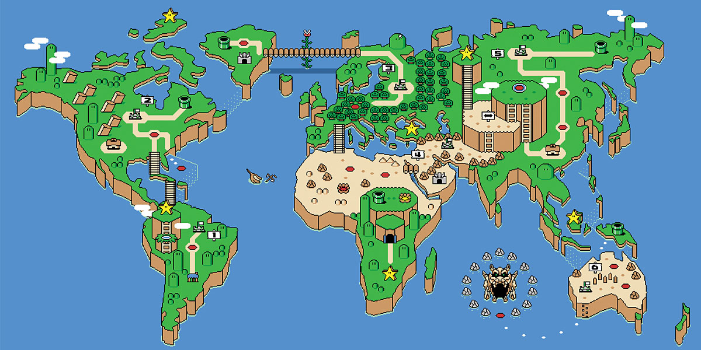
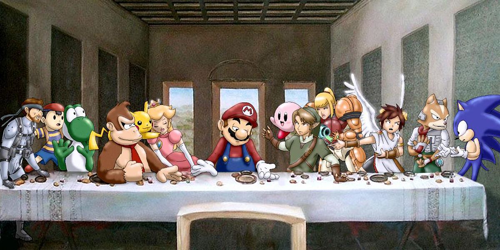

# Slide Show

### Overview

To generate a presentation of a images serie, I'll need to create a simple slide that will works only with buttons. 

In the middle of the screen will have a frame container with the images and on the sides the user could control the slides with buttons to go forward and backward in the presentation.

For this project will be just 5 images, but this could grow if the user need it, without change it the js file.

## Problem

**Alternate some images** when user press one button
The user only have 2 options: _left and right_.

## Background

There's a lot of slide shows at the web, also exist some apps to avoid the time of develop this, but the importance to me to do this is generate the skills and most of all change my way of thinking, so for this I generated everything since cero.

## Hypothesis

Setting superimposed all the images with not visible style until the user use each button ~~left & right~~ Controlling the slide with both of them.

## Solution Proposal

Putting all the images as `display: none` as default and superposed, and then change this property to `display: inline` to allow to see the image after the user use one of the 2 buttons.

Every time that the user click on one button, it will call one of the corresponding function to change the `display` property to make visible the next image and hide the previous one, ~this can also be applied in countdown~.

### Theory of Operation

In **JavaScript**: as we know that all the **images are superimposed** and the default display style is **none** we need something to start with the first image with the follow flow:

```
                  +--------------------+
                  |                    |
                  |     Get images     |
                  |    in an Array     |
                  |  [li,li,li,li,li]  |
                  |                    |
                  +---------+----------+
                            |                            
                  +---------v----------+
                  |    funtion that    |
                  |  allow to see the  |
                  |    first image     |   
                  +---------+----------+
                  			 |
                  +---------v----------+
                  | The user press one |
                  |   of the buttons   |
                  +--+-------------+---+
                     |             |
      +--------------v---+    +----v------------+
      |   If user press  |    |  If user press  |
      |    left button:  |    |  right button:  |
+----->                  |    |                 <-----+
|     |   substract 1    |    |      add 1      |     |
|     |   to the index   |    |   to the index  |     |
|     |   of the array   |    |   of the array  |     |
|     +--------------+---+    +----+------------+     |
|                    |             |                  |
|                 +--v-------------v---+              |
|                 |   eliminate the    |              |
|                 | visibility of the  |              |
|                 |   previous slide   |              |
|                 +---------+----------+              |
|                           |                         |
|                 +---------v----------+              |
|                 |  if the number is  |              |
|                 |  bigger or smaller |              |
|                 |  than array.length |              |
|                 |  reset the counter |              |
|                 +---------+----------+              |
|                           |                         |
|                 +---------v----------+              |
|                 |  add visibility to |              |
|                 |  the current item  |              |
|                 +----+----------+----+              |
|                      |          |                   |
+----------------------+          +-------------------+

```

## Functional Specification

#### Load the Document | Call the style | set only the first image with diplay:inline; property
Appears the index document that shows a big title at the top, one medium image at the center of the screen and one button on each side of the image.

#### On Button right click
Calls a function that remove the `display: inline` property to the previous image ~with other function~ and adds one number to the variable that extracts the items of the array, checking if the number is less than `array.length` or reset to zero if isn't, after this, the function adds the `display: inline` to the next image ~with other function too~.

#### On Button left click
It is the same as the before function, but with the difference that this subtracts one number instead of add it.

## Technical Specification

#### HTML Document
In the **_HTML_** document, we need to separated all the elements in differents divs:

1. The `header` with the name of the project
2. One `section` that contains all the slideshow including its buttons. 
      - One `div` for each `button` and its class. 
      - Other `div` for all the images that will be in an **unordered list** as `li` for take them as element in one `array`.
      

```
<section>
	<div class="buttons-style">
		<button></button>
	</div>
	<div id="image_container">
		<ul>
			<li class="banner-image"></li>
			<li class="banner-image"></li>
			<li class="banner-image"></li>
			<li class="banner-image"></li>
			<li class="banner-image"></li>
		</ul>
	</div>
	<div class="buttons-style">
		<button></button>
	</div>
</section>

```


```   
 +---------------------------------------------------+
 |                      HEADER                       |
 |                                                   |
 | +-----------------------------------------------+ |
 | |                   SECTION                     | |
 | |          +-------------------------+          | |
 | |          |                         |          | |
 | |          |                         |          | |
 | | +-----+  |          IMAGES         |  +-----+ | |
 | | | BTN |  |                         |  | BTN | | |
 | | +-----+  |                         |  +-----+ | |
 | |          +-------------------------+          | |
 | +-----------------------------------------------+ |
 +---------------------------------------------------+

```

#### Style Sheet

In the **_Style sheet_**, we need to set the position of all the elements and set as default the `display` property as `none` to avoid the lack of visibility to superimpose the images, and set the limit of the divs to avoid errors.

We'll have one class for all the images with the default property display as none, and we'll have another class for apply letter with Javascript to change the visibility of the image.


```
.banner-image img {
	display: none;
	height: 300px;
	position: absolute;
}

go-visible {
	display: inline;
}

```

#### Script

For the script of this project we'll need the following elements:

1. **One** `array` to extract the images items.
2. **One** `var` index to select the items into the array
3. **One** `function` that activate the first image when the document is loaded
3. **Two** `Functions` that activate and deactivate the class with the property display to make posiible the visualization of the next image.
4. **Two** `functions` that works as a loop adding or substracting one number every time that the user press one of the buttons.


For the beginning, we'll have first the array that will collect the `li` items, and the variable index to select the items in the array.

``` 
var bannerImages = document.getElementsByTagName("li");
var index = 0;

```

After that, we'll need a function for starting the slide and make possible to visualize the first image before press one of the buttons. This will be possible with an event listener.

```
document.addEventListener('DOMContentLoaded' , function(){
	bannerImages[0].classList.add('go-visible');
});
```

Now for make possible the change of class we'll use the follow functions to apply and remove the class with the property `display: none;`

```
function addClass(){
	bannerImages[index].classList.add('go-visible');
}
function removeClass(){
	bannerImages[index].classList.remove('go-visible');
}
```

Once we have the switch off the the visibility of our images we can set the functions loops.

First the function that works when the user press the right button:

We need to remove the visibility to the last image, so before doing something we set this, after, we need to add one number to select the next image and then establish one flag for avoid go further than the quantity of items in the array.

```
function loopPlus(){
	removeClass();
	index = index + 1;
	if(index < bannerImages.length){
		addClass();
	} else {
		index = 0;
		addClass();
	}
}
```

Now the following code indicates the function that will works when the user press the left button:

Similar that the function before, we need to remove the visibility for the before image and then subtract one number to apply the `display` property as `inline`. We need to set a flag too, for go to the last image once we go less than 0.

```
function loopLess(){
	removeClass();
	index = index - 1;
	if(index < bannerImages.length && index >= 0){
		addClass();
	} else {
		index = 5;
		addClass();
	}
}
```

## Tests

For know if the **property display** can work:

- [ ] Test if the change of property display works like a transition between images
- [ ] Test if with the divs in correct style we can have everything superposed

About **JavaScript** test

- [ ] Test if I can have the images in an array
- [ ] Test to start with the first image, but in this part I can loaded so I discovered that I need an event listener that active when the document is loaded.
- [ ] When the buttons are push the banner works, but after the number go further than the limits, the images just disappeared. I repaired this sething the `addition operator` before the flag.